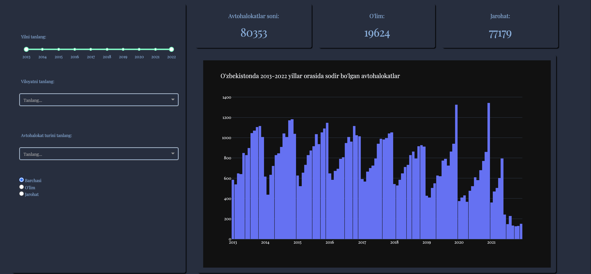

# Traffic accidents statistics


Every year, hundreds of accidents happen on the roads of Uzbekistan. Some of these accidents bring few damages to passengers and transport, but others can take away lives. The presence of road rules and necessary infrastructure guarantees the appropriate movement of passengers and transport. However, in order to reduce the number of accidents, throughout investigation should be carried out.

## About the app

This project aims to solve this problem by developing a web application that shows the number of road accidents in each region on the map. Data about each accident can be accessed via API of Open Data Portal. It is regularly uploaded by the Traffic Safety Department of Ministry of Internal Affairs of the Republic of Uzbekistan. By knowing exactly which type of accident occurs in which area, it becomes easier for authorities to see the big picture and take necessary actions to reduce their number that may occur in the future.
Check out the <a href="[http://example.com/](http://aziza2027.pythonanywhere.com/)" target="_blank">website</a>.
## Getting Started

### Running the app locally

First create a virtual environment with conda or venv inside a temp folder, then activate it.

```
virtualenv venv

# Windows
venv\Scripts\activate
# Or Linux
source venv/bin/activate

```

Clone the git repo, then install the requirements with pip

```

git clone https://github.com/Aziza2027/Traffic-accidents-statistics.git
cd Traffic-accidents-statistics
pip install -r requirements.txt

```

Run the app

```

python application.py

```

## About the app

This Dash app displays oil production in western New York. There are filters at the top of the app to update the graphs below. By selecting or hovering over data in one plot will update the other plots ('cross-filtering').

## Built With

- [Dash](https://dash.plot.ly/) - Main server and interactive components
- [Plotly Python](https://plot.ly/python/) - Used to create the interactive plots

## Screenshots

The following are screenshots for the app in this repo:




